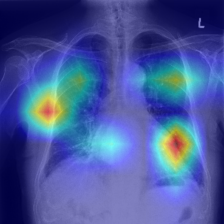

## Evaluation of Vision Transformers for Automatic Lung Disease Analysis in Chest X-rays

In recent times computer aided diagnosis techniques have paved a new way specially in
vision related tasks. In chest radiography, for automated disease classification convolutional neural networks have been in practice for their superior performance. But in
recent times vision transformer, a convolution free architecture with attention mechanism,
achieved better accuracy in other vision related tasks. In this thesis work, we evaluate
the application of vision transformer on chest radiographs. We compare various variants
of vision transformer with the state of the art convolutional models. We achieved a higher
accuracy using a vision transformer with pre-trained weights by using weighted loss
function over Resnet50 on an imbalanced dataset. Also variants of vision transformers
with different depth, scale and architecture were compared to give insights about the
application.

In this project we compare the performance of vision transformers and other state of the art CNN models not only in regards with accuracy but also localization.

<figure>

  
  <figcaption><h2 align="center">Fig.1 - Resnet result.</h2></figcaption>
  

</figure>
As seen from the picture above CNN models can not only classifies but also can localize the exact spots for further assesment from the radiologist.

<figure>

  
  <figcaption><h2 align="center">Fig.2 - ViT result.</h2></figcaption>
  

</figure>
Although ViT models can outperform the CNN models by accuracy metrics, it is not that much capable of localizing the error. We can see from the attention weights on the picture above.